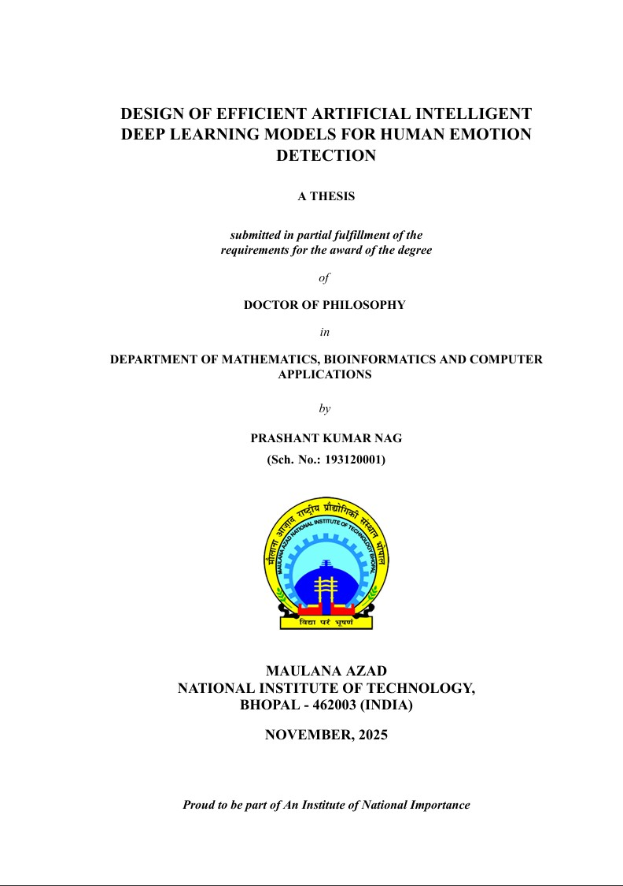

# MANIT PhD Thesis Template

A Quarto extension template for formatting PhD theses according to MANIT (Maulana Azad National Institute of Technology) guidelines.

## Preview

📄 **[View Sample PDF](draft/PhD_Thesis.pdf)** - See what your thesis will look like with this template



## Features

-  MANIT-compliant formatting
-  Automated front matter (abstract, acknowledgements, declaration, etc.)
-  Bibliography management with BibLaTeX
-  Support for multiple output formats (PDF, HTML, DOCX)
-  Chapter-based organization
-  Automated table of contents, list of figures, and list of tables
-  Symbol and abbreviation lists
-  Publication list support

## Prerequisites

Before using this template, ensure you have the following installed:

1. **Quarto** (>= 1.3): Download from [https://quarto.org/docs/get-started/](https://quarto.org/docs/get-started/)
2. **LaTeX Distribution**:
   - Windows: MiKTeX or TeX Live
   - Mac: MacTeX
   - Linux: TeX Live
3. **R or Python** (optional, if using code chunks)

## Installation

### Method 1: Using Git Clone

```bash
git clone https://github.com/ResearchInfuser/manit-thesis.git
cd manit-thesis
```

### Method 2: Download ZIP

Download the repository as a ZIP file and extract it to your desired location.

## Project Structure

```
manit-thesis/
 _quarto.yml              # Main configuration file
 index.qmd                # Entry point (includes Chapter 1)
 MyLibrary.bib           # Your bibliography file
 publications.bib        # Your publication list
 Chapters/               # Chapter files
    01_Chapter1.qmd     # Introduction
    02_Chapter2.qmd     # Literature Review
    03_Chapter.qmd      # Methodology
    04_Chapter.qmd      # Results
    05_Chapter.qmd      # Discussion
    06_Chapter.qmd      # Conclusions
    07_Chapter.qmd      # Additional Contributions
    08_list_of_publications.qmd
    09_references.qmd
 Frontmatter/            # Front matter files
    abstract.tex
    acknowledgements.tex
    dedication.tex
    declaration.tex
    abbreviations.tex
    symbols.tex
 Figures/                # Place your figures here
 images/                 # Template images
 Appendices/             # Appendix files (optional)
 _extensions/            # Quarto extensions (DO NOT MODIFY)
 draft/                  # Output directory (generated)
```

## Quick Start

### 1. Configure Your Thesis

Edit `_quarto.yml` to add your personal information:

```yaml
book:
  title: "[Your Thesis Title]"
  author:
    name: "[Your Name]"

thesis:
  scholar-number: '[Your Scholar Number]'
  department: "[Your Department]"
  institute: "[Your Institute]"
  phd-start-date: "[Month Year]"
  phd-end-date: "[Month Year]"
  keywords: "[Keywords]"
  
  supervisor:
    name: "[Supervisor Name]"
    designation: "[Designation]"
```

### 2. Edit Front Matter

Update files in the `Frontmatter/` directory:

- `abstract.tex` - Your thesis abstract
- `acknowledgements.tex` - Acknowledgements
- `dedication.tex` - Dedication (optional)
- `declaration.tex` - Declaration statement
- `abbreviations.tex` - List of abbreviations
- `symbols.tex` - List of symbols

### 3. Write Your Chapters

Edit the chapter files in `Chapters/`:

- Start with `01_Chapter1.qmd` for your introduction
- Continue with subsequent chapters
- Each file uses Quarto markdown syntax

### 4. Add References

Add your references to `MyLibrary.bib` in BibTeX format:

```bibtex
@article{author2023title,
  title={Title of the Article},
  author={Author, First and Author, Second},
  journal={Journal Name},
  year={2023}
}
```

### 5. Build Your Thesis

#### Generate PDF

```bash
quarto render
```

Or specifically for PDF:

```bash
quarto render --to manit-thesis-pdf
```

#### Generate HTML (for preview)

```bash
quarto render --to html
```

#### Generate DOCX

```bash
quarto render --to docx
```

### 6. Preview While Writing

Use Quarto's preview mode for live updates:

```bash
quarto preview
```

## Customization

### Adding Figures

Place figures in the `Figures/` directory and reference them in your chapters:

```markdown
{#fig-label}

As shown in @fig-label, we can see...
```

### Adding Tables

Create tables using markdown or Quarto syntax:

```markdown
| Header 1 | Header 2 |
|----------|----------|
| Cell 1   | Cell 2   |

: Caption for your table {#tbl-label}
```

### Cross-References

- Sections: `@sec-label`
- Figures: `@fig-label`
- Tables: `@tbl-label`
- Equations: `@eq-label`

### Citations

Cite references using `@citekey`:

```markdown
According to @author2023title, the method works well.
Multiple citations [@author2023title; @another2022paper].
```

## Advanced Features

### Adding Appendices

Uncomment the appendices section in `_quarto.yml`:

```yaml
appendices:
  - Appendices/AppendixA.qmd
```

### Code Chunks

Include code in your thesis:

````markdown
```{python}
#| echo: true
#| label: fig-plot
#| fig-cap: "Sample plot"

import matplotlib.pyplot as plt
plt.plot([1, 2, 3], [1, 4, 9])
plt.show()
```
````

### Math Equations

Use LaTeX math syntax:

```markdown
Inline equation: $E = mc^2$

Display equation:
$$
\frac{\partial f}{\partial x} = \lim_{h \to 0} \frac{f(x+h) - f(x)}{h}
$$ {#eq-derivative}
```

## Troubleshooting

### Common Issues

1. **PDF generation fails**
   - Ensure LaTeX is properly installed
   - Check that all required packages are installed
   - Run `quarto check` to verify installation

2. **Bibliography not showing**
   - Verify `MyLibrary.bib` syntax
   - Ensure citations are used in the text
   - Check BibLaTeX backend is installed

3. **Figures not appearing**
   - Check file paths are correct
   - Ensure images exist in the specified location
   - Verify image formats are supported (PNG, PDF, JPG)

4. **Cross-references not working**
   - Ensure labels are unique
   - Check label syntax matches Quarto conventions
   - Rebuild the entire project

### Getting Help

- Quarto Documentation: [https://quarto.org/docs/](https://quarto.org/docs/)
- MANIT Guidelines: Check with your department
- Issues: Open an issue on GitHub

## Contributing

Contributions are welcome! Please feel free to submit a Pull Request.

## License

This template is released under the MIT License. See [LICENSE](LICENSE) for details.

## Acknowledgments

This template is designed for PhD students at MANIT, Bhopal. It follows the official thesis formatting guidelines.

## Citation

If you use this template, please cite it as:

```bibtex
@software{manit_thesis_template,
  title={MANIT PhD Thesis Quarto Template},
  author={[Template Author]},
  year={2024},
  url={https://github.com/ResearchInfuser/manit-thesis}
}
```

## Support

For questions or support, please:
- Open an issue on GitHub
- Contact the template maintainer
- Refer to Quarto documentation

---

**Good luck with your thesis! **
